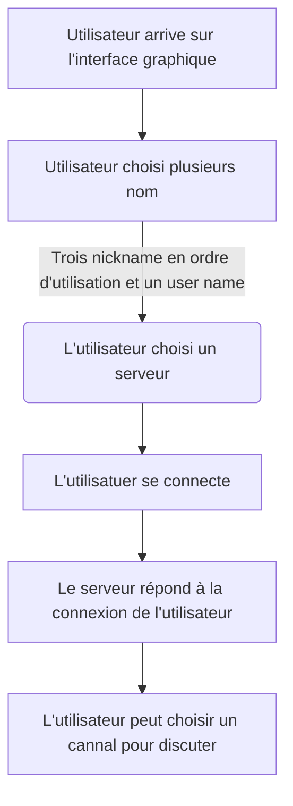

```mermaid
flowchart TD

    A[Utilisateur arrive sur l'interface graphique] --> B

    B[Utilisateur choisi plusieurs nom] -->|Trois nickname en ordre d'utilisation et un user name| C(L'utilisateur choisi un serveur)

    C --> D[L'utilisatuer se connecte]

    D --> E[Le serveur répond à la connexion de l'utilisateur]

    E --> F[L'utilisateur peut choisir un cannal pour discuter]
```