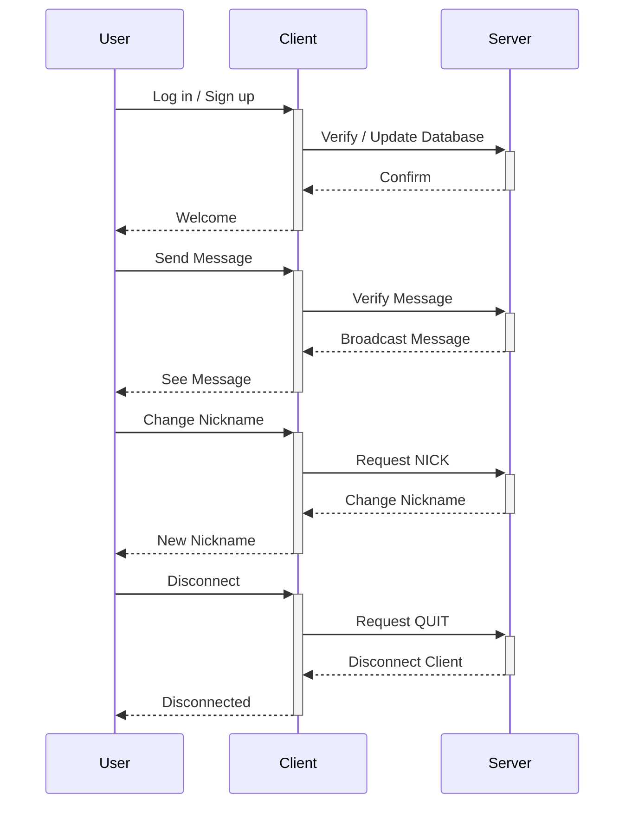

```mermaid
sequenceDiagram

    User->>+Client: Log in / Sign up

    Client->>+Server: Verify / Update Database

    Server-->>-Client: Confirm

    Client-->>-User: Welcome

  

    User->>+Client: Send Message

    Client->>+Server: Verify Message

    Server-->>-Client: Broadcast Message

    Client-->>-User: See Message

  

    User->>+Client: Change Nickname

    Client->>+Server: Request NICK

    Server-->>-Client: Change Nickname

    Client-->>-User: New Nickname

  

    User->>+Client: Disconnect

    Client->>+Server: Request QUIT

    Server-->>-Client: Disconnect Client

    Client-->>-User: Disconnected
```

Missing:

1. Error handling
2. Probably some other features